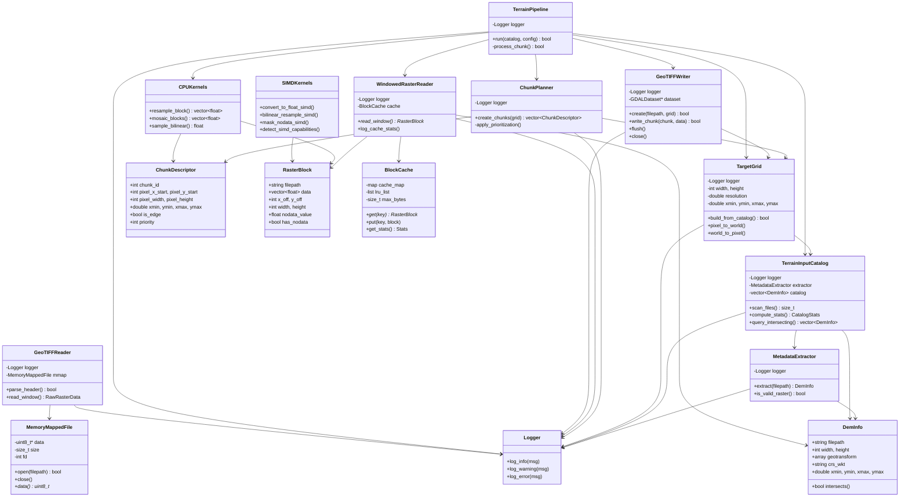

# Terrain Builder - Architecture Diagrams

## 1. System Overview - High-Level Architecture


---

## 2. Detailed Module Architecture


---

## 3. Data Flow Architecture


---

## 4. Memory Architecture


---

## 5. Custom I/O Architecture


---

## 6. Processing Pipeline Architecture


---

## 7. Class Hierarchy and Dependencies



---

## 8. Cache Architecture

```mermaid
graph TB
    subgraph "LRU Block Cache (256 MB)"
        A[Cache Map<br/>key → iterator]
        B[LRU List<br/>Front = MRU<br/>Back = LRU]
        
        C[Block 1<br/>Recently Used]
        D[Block 2]
        E[Block 3]
        F[Block N<br/>Least Recently Used]
    end
    
    subgraph "Cache Operations"
        G[get key]
        H[put key, block]
        I[evict]
    end
    
    subgraph "Cache Stats"
        J[Hits: 40-60%]
        K[Misses: 40-60%]
        L[Evictions]
        M[Hit Rate = hits/(hits+misses)]
    end
    
    G -->|Key exists?| A
    A -->|Yes| C
    A -->|Move to front| B
    C --> J
    
    G -->|Key not found| K
    K --> H
    
    H -->|Check size| B
    B -->|Full?| I
    I -->|Remove LRU| F
    I --> L
    
    H -->|Insert at front| C
    
    J --> M
    K --> M
    
    style A fill:#e1f5ff
    style B fill:#fff3e0
    style C fill:#c8e6c9
    style F fill:#ffcdd2
    style J fill:#c8e6c9
    style K fill:#ffccbc
    style M fill:#e1bee7
```

---

## 9. Chunk Processing Workflow


---

## 10. SIMD Optimization Architecture


---

## 11. File Format Support Architecture


---

## 12. Performance Comparison

### 12a. Processing Time Comparison (Bar Chart)


### 12b. Throughput Comparison (Bar Chart)


### 12c. Speedup Factor (Visual Scale)


### 12d. Performance Metrics Table

| Metric | HEC-RAS | Current | Custom I/O | GPU Future |
|--------|---------|---------|------------|------------|
| **Processing Time** | 15 hrs | 3 hrs | 1.2 hrs | 0.55 hrs (33 min) |
| **Throughput** | 1.1 MB/s | 6.3 MB/s | 15.6 MB/s | 38.2 MB/s |
| **Speedup** | 1× | 5× | 12.5× | 27× |
| **Cost/Run** | High | Medium | Low | Very Low |
| **Status** | Baseline | Deployed | In Progress | Planned |

### 12e. Time Breakdown Comparison


---

## 13. Future GPU Architecture (Phase 3)


---

## 14. Multi-Threading Architecture (Future)


---

## 15. Complete System Context


---

## Summary

These diagrams illustrate:

1. **System Overview** - High-level data flow through all phases
2. **Module Architecture** - All 5,302 lines organized by module
3. **Data Flow** - Complete pipeline from input to output
4. **Memory Layout** - How memory is allocated and managed
5. **Custom I/O** - Memory-mapped files and SIMD optimization
6. **Processing Pipeline** - Sequence of operations
7. **Class Hierarchy** - OOP structure and dependencies
8. **Cache Architecture** - LRU cache design and performance
9. **Chunk Workflow** - State machine for chunk processing
10. **SIMD Optimization** - CPU feature detection and fast paths
11. **File Format Support** - Multi-format input handling
12. **Performance Comparison** - HEC-RAS → Current → Future
13. **GPU Architecture** - Future CUDA implementation
14. **Multi-threading** - Future parallel processing
15. **System Context** - External system relationships

**Total**: 15 comprehensive architecture diagrams covering the entire 5,302-line codebase.
